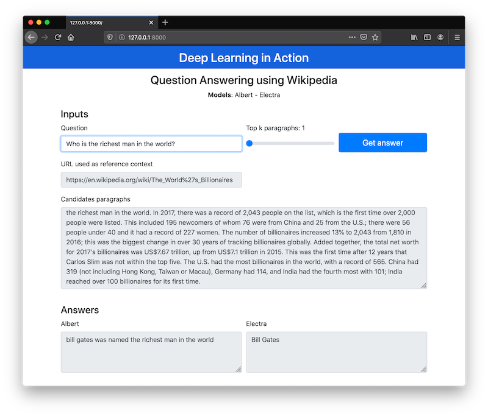
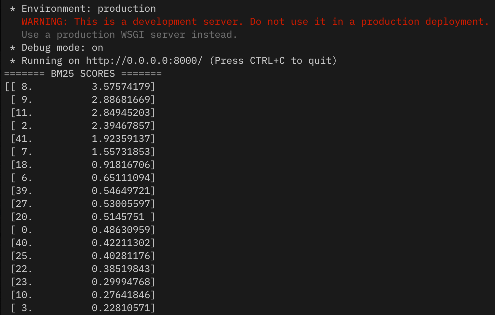

# Question-Answering-Albert-Electra
Question Answering using Albert and Electra using wikipedia text as context.

## Description
This repository implements a pipeline to answer questions using wikipedia text. Bellow is the pipeline:
1. Using the input query, search on google filtering the wikipedia pages.
2. Read the body content of the wikipedia, preprocess text and split the corpus in paragraphs.
3. Using BM25 algoritm rank the best candidate passages, using the top K paragraphs.
4. Selected paragraphs are used as input to Albert and Electra models.
5. Both models try to find the answer given the candidate paragraphs.

## Running
To predict with Electra, you need to download the pre-trained model from [here](https://drive.google.com/open?id=1nAsDHvIQVckrzOnuStyiJodnzr-S4Lvi). Extract the folder and adjust the DATA_MODEL_DIR (line 26) in [qa_predict.py](qa_predict.py) to point to the root folder.

